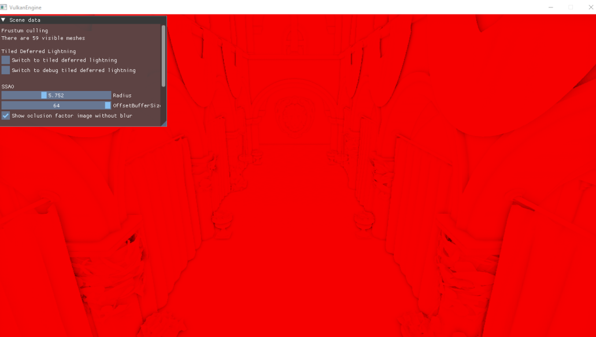
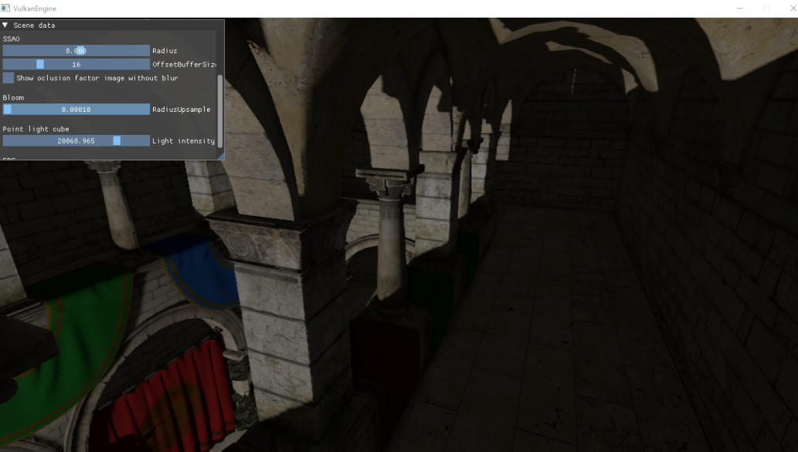

# VKModernRenderer
 
# How to build the project

Make sure to have visual studio 2022 with a C++20 compiler and vcpkg installed and configured.

- Install requests using pip: pip install requests

- Run build.py found in root directory.

- Run the already present visual studio .sln and compile. Thats it. You can run the renderer now.

# Features
- Indirect rendering
- FXAA
- SSAO
- PBR point light
- Static omnidirectional shadow map
- Tiled deferred shading in compute shader
- CPU Frustum culling
- Bloom
- HDR
- Scene conversion for serializing geometry and material data of models for indirect rendering
- Spirv-v reflection for spirv shader bytecode using Spirv-Reflect for easier pipeline creation

# Render samples

-Tiled deferred shading

-SSAO

-Bloom

-Frustum culling on cpu

-Static Omnidirectional shadow map

# TODO
- Volumetric fog
- Replace tiled deferred with clustered deferred
- Frame graph to make transition layout between image layouts automatic
- SSR
